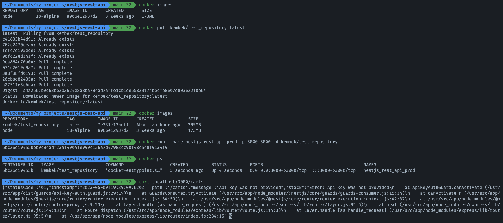

# nestjs-rest-api
NestJS Product API template

## Build Docker image
For building and registiring an image of the application run 

```
bash ./buil_docker_image.sh
```

## Result of pulling
Image where the image is pulled and created a container from it.



## Used commands

`docker images` - to output list of images

`docker image ls` - to output list of images

`docker build -t <name_of_image> PATH | URL | -`  - to create an image, example: `docker build -t nestjs_rest_api_prod .`

`docker ps` - to output list of containers 

`docker stop <container_id>` - stop a container by id

`docker run --name <container_name> -p IN_PORT:OUT_PORT -d <image_name>` - create and run a container from an image, example: `docker run --name nestjs_rest_api_prod -p 3000:3000 -d nestjs_rest_api_prod`

`docker exec -it <container_name> sh` - go to inside of a container, example: `docker exec -it nestjs_rest_api_prod sh`

`docker logs <container_id>` - show logs by a container’s id

`docker container prune` -  remove unused containers 

`docker image prune` - remove unused images

`docker image rm <image_name>` - delete a certain image

`docker push <image_name>` - upload an image to a registry,  example: `docker push kembek/test_repository:latest`

`docker pull <image_name>` - download an image from a registry, example: `docker pull kembek/test_repository:latest`

`docker tag <old_image_name> <new_image_name>` - example: `docker tag nestjs_rest_api_prod:latest kembek/test_repository:latest`

`docker login` - login into the Docker hub for publishing custom images

`docker search <image_name>` - find a necessary image